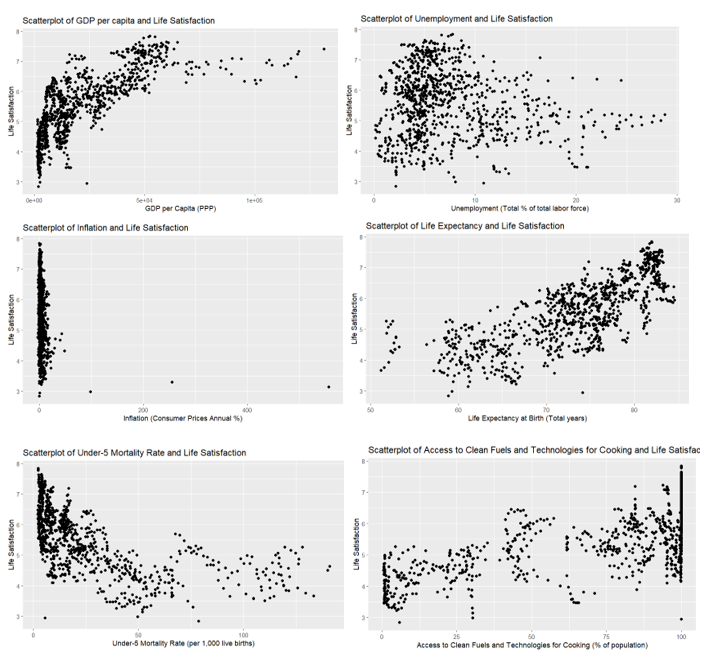
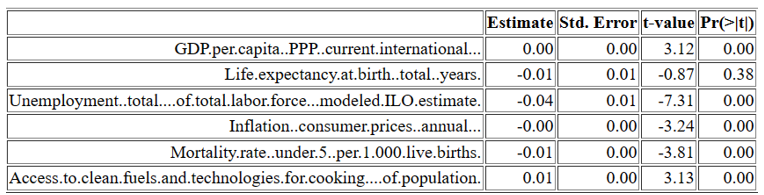
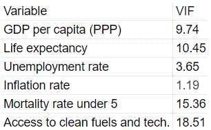

# Life Satisfaction Econometrics Project

Tools: R, Econometrics, Panel Data Analysis, Statistical Diagnostics

This project analyses the relationship between life satisfaction and economic, health, and environmental indicators across countries using panel data regression in R.

The study was originally completed as part of my MSc Economics dissertation at Birkbeck, University of London.

## Project Overview

The analysis investigates how life satisfaction is associated with:

- GDP per capita
- Life expectancy
- Unemployment
- Inflation
- Under-5 mortality
- Access to clean fuels and technologies for cooking

The dependent variable is the Cantril Ladder life satisfaction score.

## Key Findings

- GDP per capita showed a positive relationship with life satisfaction.
- Higher unemployment and under-5 mortality rates were associated with lower life satisfaction.
- Access to clean cooking fuels and technologies was positively associated with wellbeing.
- Diagnostic testing identified multicollinearity and heteroskedasticity within the model.
- A fixed effects panel model was selected following Hausman testing.

## Dataset

The dataset combines international country-year observations from:

- World Happiness Report
- World Bank World Development Indicators
- Our World in Data

The final analysis used 944 country-year observations across 118 countries.

## Methods Used

- Panel data regression
- Fixed effects model
- Random effects model
- Hausman test
- Variance Inflation Factor test
- Breusch-Pagan test
- Scatter plot analysis
- Descriptive statistics

## Technologies Used

- R
- plm
- ggplot2
- stargazer
- xtable
- psych
- lmtest
- car
- Excel

## Key Findings

The analysis found that GDP per capita, unemployment, inflation, under-5 mortality, and access to clean cooking fuels were significantly associated with life satisfaction.

The Hausman test supported the use of a fixed effects model. Diagnostic testing also identified multicollinearity and heteroskedasticity, which were discussed as limitations and areas for further improvement.

## Screenshots

### Variable Relationships



### Regression Results



### Multicollinearity Diagnostics



### Heteroskedasticity Test


## Project Structure

```text
Life-Satisfaction-Econometrics/
│
├── dissertation_analysis.R
├── Dissertation life satisfaction.docx
├── scatterplots.png
├── regression_results.png
├── vif_results.png
├── breusch_pagan_test.png
└── README.md
```

## Limitations

The model showed evidence of heteroskedasticity and multicollinearity. Future work could improve the analysis using robust standard errors, alternative model specifications, and additional social indicators.

## Author

Sarunas Surdokas
